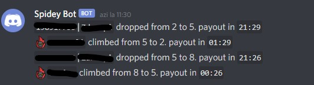

# IPD-tracker-stats-bot
IPD tracker stats bot for discord

# Version
V1.0.2
- now works only with rotbot installation of IPD

V1.0.6
- webhook channel for debugging
- catches some errors
- sends dm when does not have Permissions
- fix finding shard members in dropped by

## Invite to discord:	
[invite the bot to your server](https://discord.gg/949u6vUhRU)

[support discord server](https://discord.gg/CJYSH3dt)

## Bot permissions needed:	

View channels	

Read message history	

Send messages	

Manage messages	

## Commands:		

`$help`	| show help message of all commands

`$icon ICON`  | Set enemy icon id in IPD-FOR-ROTBOT output | ex: `$icon 834303658727309364`

`$settings`	| show current settings

`$stats #channel days` | make stats for #channel that outputs IPD-FOR-ROTBOT for number of days	| ex: `$stats #ipd-rotbot 5`

## Usage:	

You will need [ipd](https://github.com/iprobedroid/swgoh-arena-tracker) and [rotbot](http://rotbot.eu/) with [sniper](http://rotbot.eu/sniper-rb/) installed and a channel that IPD has its webhook.

Rotbot installation needs to be a clean one. The use of ,suicon is forbidded, it will overwrite the ,seicon needed to identify enemies.

Bot is in beta development so it will not remmember settings, please set $icon before running $stats command.

Use $help to get syntax in discord.	

You need also the following setup:

1. install IPD

2. invite rotbot to your discord server

3. setup sniper for rotbot and check if its working

4. in the discord server load a custom emoji and get the ID of the custom emoji, mine is called enemy and has 834303658727309364 as an id

5. run the `,seicon :enemy:` command to setup rotbot to have a enemy icon in the IPD channel

7. wait a few days so that you have an output in the IPD channel for the bot to succesfully parse

6. run the `$icon 834303658727309364` command to tell the bot that the enemies are marked with this icon id in the IPD channel. Output should look like below

7. run the `$stats #channel days` command 	
